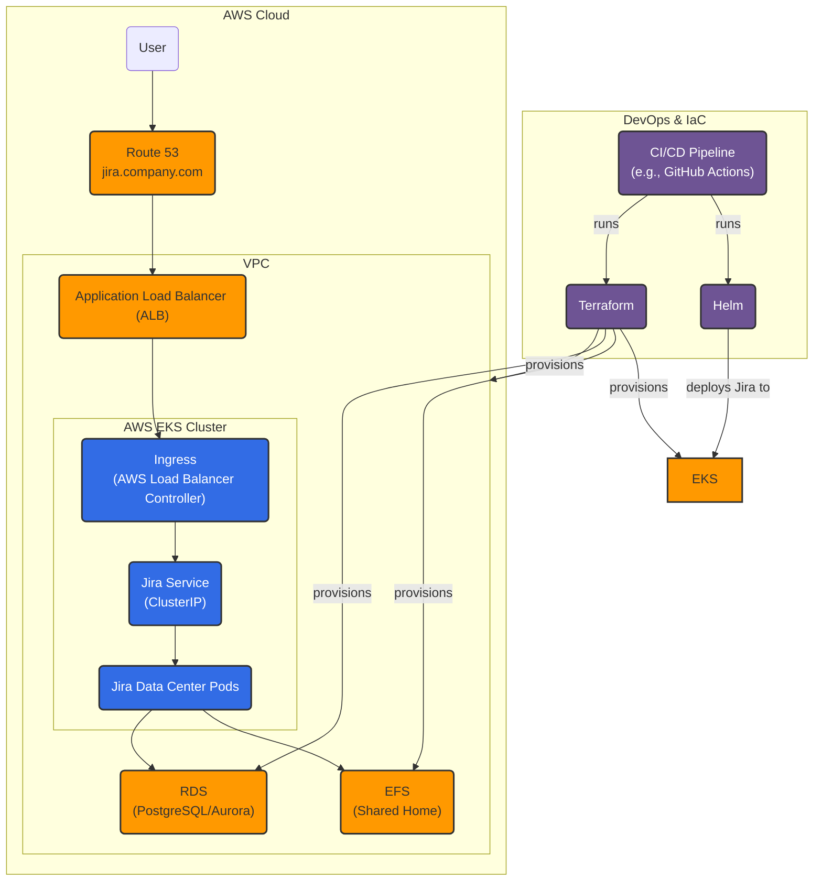

# Jira on AWS EKS – Reference Implementation (FAANG-Style Design Walkthrough)

This repository is a **reference implementation** and **storyboard** you can use in a system design interview when asked:

> “Explain to me how you would design and deploy Jira application on AWS Kubernetes – give details, architecture, DevOps, and any other aspect and walk me through your thinking process.”

It contains:

- A **FAANG-style design narrative** (requirements → architecture → DevOps → ops & trade-offs).
- A **Mermaid architecture diagram**.
- **Terraform skeleton** for AWS (VPC, EKS, RDS, EFS, ALB controller).
- A **Helm chart** for Jira Data Center on EKS.
- An example **GitHub Actions** pipeline to deploy Jira to EKS.

> ⚠️ This is not production-ready out-of-the-box. It’s intentionally simplified to be easy to talk through, extend, and tune during interviews or POCs.

---

## Repository Layout

```text
jira-on-aws-eks/
├─ README.md
├─ docs/
│  └─ architecture.md
├─ infra/
│  └─ terraform/
│     ├─ main.tf
│     ├─ variables.tf
│     ├─ outputs.tf
│     ├─ network/
│     │  ├─ main.tf
│     │  ├─ variables.tf
│     │  └─ outputs.tf
│     ├─ eks/
│     │  ├─ main.tf
│     │  ├─ variables.tf
│     │  └─ outputs.tf
│     ├─ rds/
│     │  ├─ main.tf
│     │  ├─ variables.tf
│     │  └─ outputs.tf
│     ├─ efs/
│     │  ├─ main.tf
│     │  ├─ variables.tf
│     │  └─ outputs.tf
│     └─ alb-ingress-controller/
│        ├─ main.tf
│        ├─ variables.tf
│        └─ outputs.tf
├─ k8s/
│  └─ helm/
│     └─ jira/
│        ├─ Chart.yaml
│        ├─ values.yaml
│        └─ templates/
│           ├─ _helpers.tpl
│           ├─ deployment.yaml
│           ├─ service.yaml
│           ├─ ingress.yaml
│           ├─ configmap.yaml
│           ├─ secret.yaml
│           ├─ pv-efs.yaml
│           └─ pvc-efs.yaml
└─ ci-cd/
   └─ github-actions/
      └─ deploy-jira.yaml
```

---

## 1. Requirements & Assumptions (What We’re Designing)

In an interview, start by framing assumptions and requirements.

- **Jira Edition**: We assume **Jira Data Center** (clusterable, container-friendly) – not a single-node Server install.
- **Scale**: Mid-to-large org, say **2–5k active users**, 24/7 availability, multiple teams.
- **Non-functional requirements**:
  - **High availability** across multiple AZs.
  - **RPO** ≤ 15 minutes, **RTO** ≤ 1–2 hours.
  - **Security**: SSO (SAML/OIDC), encryption in transit & at rest, private networking.
  - **Ops**: Prefer managed services to reduce toil.

**High-level solution**:

> Jira Data Center on **AWS EKS**, backed by **RDS (PostgreSQL/Aurora)** and **EFS**, fronted by an **ALB** via the AWS Load Balancer Controller, with everything managed via **Terraform + Helm + CI/CD**.



---

## 2. High-Level Architecture

Core AWS components:

- **EKS** – Managed Kubernetes control plane.
- **RDS / Aurora PostgreSQL** – Jira database (multi-AZ, backups, PITR).
- **EFS** – Shared Jira home (attachments, plugins, etc.).
- **ALB** – Public entry point terminating TLS and routing HTTP(S) traffic.
- **Route 53** – DNS for `jira.company.com`.
- **ACM** – TLS certificates for ALB.
- **Secrets Manager / SSM** – Jira DB credentials, licenses, admin secrets.

Core Kubernetes components:

- Namespace: `jira-prod`.
- **Jira Data Center pods** (Deployment in this repo for simplicity, often StatefulSet in more advanced setups).
- **Service (ClusterIP)** exposing Jira internally.
- **Ingress** mapped to ALB via AWS Load Balancer Controller.
- **EFS CSI driver** for shared storage.

**Traffic flow** (user request path):

User → `jira.company.com` (Route 53) → ALB (HTTPS, TLS via ACM) → Ingress → Jira Service → Jira Pods → RDS + EFS

The architecture diagram is in `docs/architecture.md` as a Mermaid graph; GitHub will render it automatically.

---

## 3. Kubernetes & Jira Design

### 3.1 Cluster & Node Groups

- EKS in **3 AZs** for resilience.
- Separate node groups:
  - `system-ng` for core cluster services.
  - `jira-ng` for Jira pods (compute/memory tuned to JVM needs).

**Autoscaling**:

- **Cluster Autoscaler** scales nodes based on pending pods.
- **HPA** (Horizontal Pod Autoscaler) can scale Jira pods based on CPU/memory (used carefully because Jira is stateful-ish and has warm-up time).

### 3.2 Jira Deployment Model

- Jira container image:
  - Atlassian’s official Jira Data Center image or a hardened custom image.
- Deployment (this repo uses a **Deployment**; you can switch to a **StatefulSet** for stable identities).
- Config via:
  - `ConfigMap` – configuration overlays.
  - `Secret` – DB credentials, license, admin password.
- Shared storage:
  - EFS mounted into each Jira pod as the **shared home**.

Relevant files in this repo:

- `k8s/helm/jira/Chart.yaml` – chart definition.
- `k8s/helm/jira/values.yaml` – environment-specific settings (domain, DB host, EFS ID, resources).
- `k8s/helm/jira/templates/*.yaml` – Deployment, Service, Ingress, PV/PVC, Secrets, ConfigMap.

---

## 4. AWS Networking & Services

### 4.1 VPC Design

Terraform modules:

- `infra/terraform/network/` - VPC, subnets, NAT gateways, routing
- `infra/terraform/main.tf` - orchestrates all modules
- `infra/terraform/variables.tf` - global configuration

Key points:

- **VPC** with a `/16` CIDR (e.g., `10.0.0.0/16`).
- **Public subnets** (for ALB).
- **Private subnets** (for EKS nodes, RDS, EFS mount targets).
- **Security groups**:
  - ALB SG – allows `0.0.0.0/0` to 443.
  - EKS Node SG – allows traffic from ALB SG, to RDS/EFS SGs.
  - RDS SG – only from node SG on TCP 5432.
  - EFS SG – only from node SG on TCP 2049.

### 4.2 RDS / Aurora PostgreSQL

Terraform module: `infra/terraform/rds/`

- Engine: PostgreSQL (or Aurora PostgreSQL for better scaling).
- **Multi-AZ**, encrypted, deletion protection enabled.
- Automated backups & PITR.
- Parameter tuning for Jira (connections, work_mem, etc.).

### 4.3 EFS for Shared Jira Home

Terraform module: `infra/terraform/efs/`

- Single EFS file system:
  - Encrypted at rest.
  - Mount targets in each private subnet.
- Exposed to Kubernetes via the **EFS CSI driver** and used by PV/PVC:
  - `k8s/helm/jira/templates/pv-efs.yaml`
  - `k8s/helm/jira/templates/pvc-efs.yaml`

---

## 5. DevOps / IaC / CI-CD

The repo separates **infrastructure** from **application**.

### 5.1 Infrastructure as Code – Terraform

Modular Terraform structure under `infra/terraform`:

- `main.tf` orchestrates all modules:
  - **network/** - VPC, subnets, NAT gateways, routing
  - **eks/** - EKS cluster & node groups with IAM roles
  - **rds/** - PostgreSQL database with security groups
  - **efs/** - Shared file system with mount targets
  - **alb-ingress-controller/** - AWS Load Balancer Controller IAM setup
- `variables.tf` defines global inputs (region, CIDRs, DB credentials)
- `outputs.tf` exposes cluster name, DB endpoint, EFS ID

Each module has its own `main.tf`, `variables.tf`, and `outputs.tf` for clean separation of concerns.

### 5.2 Application Deployment – Helm + GitOps

Under `k8s/helm/jira`:

- `values.yaml` controls:
  - Jira replica count.
  - Docker image and tag.
  - Ingress config (ALB annotations, host, TLS secret name).
  - DB connection details and secret references.
  - EFS file system ID and mount path for Jira shared home.
  - Resource requests/limits and JVM heap settings.

The Helm chart would be applied via:

```bash
cd k8s/helm/jira
helm upgrade --install jira . -n jira-prod --create-namespace
```

You can then add **GitOps** with Argo CD / Flux, or use a CI pipeline to run the Helm commands.

### 5.3 Production Enhancements

**Secrets Management:**
- AWS Secrets Manager integration via External Secrets Operator
- Secure storage of DB credentials and Jira license
- Automatic secret rotation capabilities

**Monitoring & Observability:**
- Prometheus + Grafana stack for metrics
- AlertManager for incident response
- Custom Jira dashboards and alerts

**Backup & Disaster Recovery:**
- Automated EFS backups via AWS Backup
- RDS automated backups with 30-day retention
- Cross-region replication for DR scenarios

**Autoscaling:**
- Horizontal Pod Autoscaler (HPA) for Jira pods
- Cluster Autoscaler for node scaling
- Production-tuned resource limits

**Production Deployment:**
```bash
# Copy and customize production variables
cp infra/terraform/prod.tfvars.example infra/terraform/prod.tfvars

# Run automated production deployment
./scripts/deploy-production.sh
```

### 5.4 CI/CD Example – GitHub Actions with Argo CD / Flux, or use a CI pipeline to run the Helm commands.

### 5.3 CI/CD Example – GitHub Actions

Under `ci-cd/github-actions/deploy-jira.yaml`:

- On push to `main` that affects `k8s/helm/jira/**`:
  - Configures AWS credentials.
  - Fetches kubeconfig for the EKS cluster.
  - Installs Helm.
  - Runs `helm upgrade --install` to deploy Jira into `jira-prod` namespace.

This is a **minimal example**: in a real setup you’d add linting, Helm chart testing, notifications, approvals, and environment promotion (dev → staging → prod).

---

## 6. Scalability, Performance & Resilience

### 6.1 Scaling Jira

- **Vertical scaling**:
  - Increase Jira pod CPU/memory requests in `values.yaml`.
  - Adjust JVM heap (`jira.jvmMaxHeap`) to avoid overcommitting memory.
- **Horizontal scaling**:
  - Increase `replicaCount`.
  - Optionally enable HPA; be mindful of warm-up time and DB load.

### 6.2 Resilience & Upgrades

- **Multi-AZ** everywhere:
  - EKS worker nodes.
  - RDS Multi-AZ.
  - EFS mount targets.
- Upgrading Jira:
  - Test schema upgrades in **staging** first.
  - Use **rolling updates** with Helm.
  - For major upgrades, use **blue–green**:
    - New namespace or cluster.
    - Restore DB snapshot.
    - Validate and then cut over DNS in Route 53.

---

## 7. Observability, Logging & Monitoring

- **App logs**:
  - Jira logs written to stdout/stderr inside containers.
  - Collected by a DaemonSet agent (Fluent Bit / CloudWatch Agent) to CloudWatch Logs or ELK.
- **Metrics**:
  - Jira JVM metrics scraped by Prometheus (if you deploy it) and visualized in Grafana.
  - Kubernetes metrics (CPU, memory, pod restarts, etc.).
- **AWS metrics**:
  - RDS CPU, connections, free space.
  - ALB 4xx/5xx, target response time.
  - EKS node health.
- **Alerting**:
  - CloudWatch Alarms or Alertmanager for:
    - High error rate or 5xx at ALB.
    - Low DB free storage.
    - High JVM heap / GC pressure.
    - Increased pod restart count.

---

## 8. Security & Access

- **Network isolation**:
  - Jira pods live in private subnets.
  - RDS has no public endpoint, reachable only from node SGs.
- **Identity & SSO**:
  - Jira integrated with corporate IdP (SAML/OIDC).
  - Jira internal RBAC for projects and roles.
- **Kubernetes security**:
  - Namespaces for environment separation (`jira-dev`, `jira-stg`, `jira-prod`).
  - RBAC to limit who can deploy or exec into Jira pods.
  - Pod security (run as non-root, read-only file systems where possible).
- **Secrets management**:
  - DB credentials, Jira license, and admin user passwords stored in AWS Secrets Manager or SSM.
  - Synced into Kubernetes Secrets (e.g., via External Secrets Operator).
- **Encryption**:
  - TLS on ALB/Ingress.
  - RDS encryption at rest (KMS).
  - EFS encryption at rest.
  - Optional envelope encryption for sensitive data in S3 backups.

---

## 9. Backups & Disaster Recovery

- **Database**:
  - RDS automated backups + PITR.
  - Optional additional periodic logical dumps to S3.
- **EFS / Shared home**:
  - EFS Backup or DataSync jobs to S3.
- **Jira configuration**:
  - Jira’s XML backups for config (careful with large instances).
- **DR Strategy**:
  - **Warm DR** – secondary region with infra pre-created; replicate DB snapshots and EFS backups on a schedule.
  - **Cold DR** – Terraform to recreate infra in another region, restore latest snapshots.

Regularly run **DR drills** to validate RTO/RPO and runbooks.

---

## 10. How to Talk This Through in an Interview

You can use this repo as a prop or mental model. A clean spoken structure might be:

1. **Restate the problem & assumptions**  
   - “I’ll assume Jira Data Center, 2–5k users, HA across AZs, with RPO 15 min/RTO 1–2 hours.”

2. **High-level architecture**  
   - Jira on EKS, backed by RDS and EFS, fronted by ALB + Route 53, secrets in Secrets Manager.

3. **Kubernetes & AWS details**  
   - Node groups, namespaces, Jira pods, ingress, DB, shared home, VPC layout, security groups.

4. **DevOps / CI-CD / IaC**  
   - Terraform for infra, Helm for app, GitHub Actions/GitOps for deployments and promotions.

5. **Operational topics**  
   - Scaling, upgrades, backups, DR, observability, security.

6. **Trade-offs & evolution**  
   - Why EKS vs EC2-only.
   - When to switch to Aurora, external search/indexing, or introduce additional caching/CDN layers.

If you walk them logically through these steps, with this repo as a concrete anchor, you’ll sound like someone who has actually built and operated this sort of platform.

---

## Quick Start (for experimentation)

> This is intentionally not plug-and-play; it’s meant to be a safe scaffold you can modify and explain.

1. **Clone & inspect**  
   Review `infra/terraform` and `k8s/helm/jira` to understand the components.

2. **Customize Terraform variables**  
   In `infra/terraform/variables.tf` set:
   - `aws_region`
   - `vpc_cidr`, subnets, AZs
   - `jira_db_password` (via `-var` or TF vars file; don’t hardcode).

3. **Apply infra (test account only!)**  
   ```bash
   cd infra/terraform
   terraform init
   terraform apply
   ```

4. **Update Helm values**  
   In `k8s/helm/jira/values.yaml` set:
   - `jira.db.host` to the RDS endpoint.
   - `jira.sharedHome.efsFileSystemId` to the Terraform output.
   - Domain and TLS secret.

5. **Deploy Jira**  
   ```bash
   cd k8s/helm/jira
   helm upgrade --install jira . -n jira-prod --create-namespace
   ```

From here you can iterate, tune, and extend as if you’re doing a real FAANG-level platform design.

