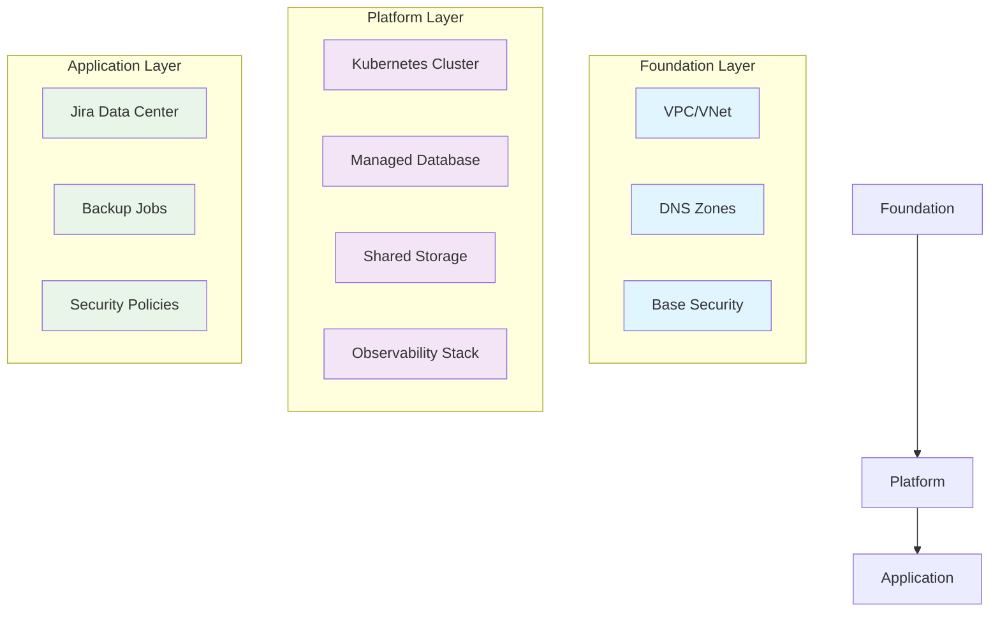

# Enterprise Jira on Kubernetes: A Production-Ready Reference Architecture

*Building scalable, resilient Atlassian Jira deployments on AWS EKS and Azure AKS*

## What You'll Learn

This repository demonstrates how to architect, deploy, and operate Jira Data Center at enterprise scale using modern cloud-native patterns. Whether you're preparing for a system design interview at a FAANG company or building production infrastructure, this guide provides battle-tested patterns and anti-patterns to avoid.

**Key Topics Covered:**
- Multi-cloud Kubernetes architecture (AWS EKS, Azure AKS)
- Infrastructure as Code with layered state management
- Resilience patterns and circuit breakers
- Enterprise observability and monitoring
- GitOps deployment strategies
- SOLID principles in infrastructure code

## Architecture Overview

Our reference implementation follows a **layered architecture** pattern that separates concerns and enables independent team workflows:



### Design Principles

1. **Separation of Concerns**: Each layer has isolated state and responsibilities
2. **Fail-Safe Defaults**: Circuit breakers and health checks prevent cascading failures
3. **Observable Systems**: Comprehensive monitoring from infrastructure to application
4. **Immutable Infrastructure**: All changes flow through version-controlled pipelines

## Quick Start

### Prerequisites

- AWS CLI configured with appropriate permissions
- Terraform >= 1.6.0
- kubectl >= 1.28
- Helm >= 3.12

### Standard Deployment (Monolithic)

For development and testing environments:

```bash
# Clone and configure
git clone https://github.com/your-org/jira-on-aws-eks.git
cd jira-on-aws-eks

# Deploy infrastructure
cd infra/terraform
terraform init
terraform apply -var-file="prod.tfvars"

# Deploy application
cd ../../k8s/helm/jira
helm upgrade --install jira . -n jira-prod --create-namespace
```

### Production Deployment (Layered)

For enterprise environments requiring team isolation:

```bash
# FAANG-grade layered deployment
./scripts/deploy-layered.sh

# Verify deployment
kubectl get pods -n jira-prod
kubectl get resourcequota,poddisruptionbudget -n jira-prod
```

## Repository Structure

```
jira-on-aws-eks/
├── infra/
│   ├── terraform/              # Standard deployment
│   └── terraform-refactored/   # Layered deployment
│       ├── foundation/         # VPC, DNS, base security
│       ├── platform/          # EKS, RDS, shared services
│       └── application/       # Jira, monitoring, policies
├── k8s/
│   ├── helm/jira/            # Standard Helm chart
│   ├── helm/jira-refactored/ # Production-hardened chart
│   └── monitoring/           # Observability stack
├── azure/                    # Azure AKS adaptation
├── gitops/                   # GitOps configurations
└── scripts/                  # Deployment automation
```

## Core Components

### AWS Implementation

**Infrastructure Services:**
- **EKS**: Managed Kubernetes with multi-AZ node groups
- **RDS/Aurora**: PostgreSQL with automated backups and read replicas
- **EFS**: Shared storage with cross-AZ replication
- **ALB**: Application Load Balancer with WAF integration
- **Route 53**: DNS with health checks and failover

**Security & Compliance:**
- AWS Secrets Manager for credential rotation
- VPC with private subnets and NAT gateways
- Security groups with least-privilege access
- Encryption at rest and in transit

### Azure Implementation

**Infrastructure Services:**
- **AKS**: Azure Kubernetes Service with zone redundancy
- **PostgreSQL Flexible Server**: Managed database with HA
- **Azure Files Premium**: High-performance NFS storage
- **Application Gateway**: Layer 7 load balancer with WAF
- **Azure DNS**: Managed DNS with traffic routing

**Security & Compliance:**
- Azure Key Vault for secrets management
- Virtual Network with private endpoints
- Network Security Groups with micro-segmentation
- Azure Policy for governance and compliance

## Production Patterns

### Resilience Engineering

Our implementation includes battle-tested resilience patterns:

**Circuit Breakers:**
```yaml
# Resource quotas prevent resource exhaustion
apiVersion: v1
kind: ResourceQuota
metadata:
  name: jira-circuit-breaker
spec:
  hard:
    requests.cpu: "20"
    requests.memory: "40Gi"
    persistentvolumeclaims: "10"
```

**Health Checks with Exponential Backoff:**
```yaml
# Startup probe allows 5 minutes for application initialization
startupProbe:
  httpGet:
    path: /status
    port: 8080
  failureThreshold: 30
  periodSeconds: 10
```

**Pod Disruption Budgets:**
```yaml
# Ensure minimum availability during updates
apiVersion: policy/v1
kind: PodDisruptionBudget
spec:
  minAvailable: 2
  selector:
    matchLabels:
      app: jira
```

### Observability Stack

**Multi-Layer Monitoring:**
- **Infrastructure**: CloudWatch/Azure Monitor for AWS/Azure services
- **Platform**: Prometheus + Grafana for Kubernetes metrics
- **Application**: Custom dashboards for Jira-specific KPIs

**Key Metrics Tracked:**
- **SLA Metrics**: 99.9% uptime, <2s response time, <0.1% error rate
- **Business Metrics**: Active users, issue creation rate, search performance
- **Infrastructure Metrics**: Resource utilization, cost per user, scaling events

### Security Hardening

**Network Policies:**
```yaml
# Micro-segmentation with least privilege
apiVersion: networking.k8s.io/v1
kind: NetworkPolicy
spec:
  podSelector:
    matchLabels:
      app: jira
  policyTypes: ["Ingress", "Egress"]
  # Only allow specific ingress/egress patterns
```

**Pod Security Standards:**
```yaml
# Run as non-root with read-only filesystem
securityContext:
  runAsNonRoot: true
  runAsUser: 2001
  readOnlyRootFilesystem: true
```

## Deployment Strategies

### GitOps with ArgoCD

```yaml
apiVersion: argoproj.io/v1alpha1
kind: Application
metadata:
  name: jira-production
spec:
  source:
    repoURL: https://github.com/your-org/jira-on-aws-eks.git
    path: k8s/helm/jira
    helm:
      valueFiles: ["values-prod.yaml"]
  syncPolicy:
    automated:
      prune: true
      selfHeal: true
```

### Blue-Green Deployments

For zero-downtime updates:

```bash
# Deploy to green environment
helm upgrade jira-green ./k8s/helm/jira -n jira-green

# Validate deployment
kubectl run test --image=curlimages/curl -- curl http://jira-green:8080/status

# Switch traffic
kubectl patch ingress jira -p '{"spec":{"rules":[{"host":"jira.company.com","http":{"paths":[{"backend":{"service":{"name":"jira-green"}}}]}}]}}'
```

## Scaling Considerations

### Horizontal Scaling

**Jira Data Center Clustering:**
- Shared EFS/Azure Files for application data
- Database connection pooling via RDS Proxy
- Session affinity for user experience

**Kubernetes Autoscaling:**
```yaml
# HPA with custom metrics
apiVersion: autoscaling/v2
kind: HorizontalPodAutoscaler
spec:
  minReplicas: 3
  maxReplicas: 10
  metrics:
  - type: Resource
    resource:
      name: cpu
      target:
        type: Utilization
        averageUtilization: 70
  - type: Resource
    resource:
      name: memory
      target:
        type: Utilization
        averageUtilization: 80
```

### Vertical Scaling

**Database Scaling:**
- Aurora Serverless v2 for automatic scaling
- Read replicas for read-heavy workloads
- Connection pooling to prevent connection exhaustion

**Storage Scaling:**
- EFS/Azure Files automatically scale with usage
- Backup strategies with point-in-time recovery
- Cross-region replication for disaster recovery

## Troubleshooting Guide

### Common Issues

**Pod Startup Failures:**
```bash
# Check init container logs
kubectl logs -f deployment/jira -c wait-for-dependencies -n jira-prod

# Verify EFS mount
kubectl exec -it deployment/jira -n jira-prod -- df -h /var/atlassian/application-data/jira
```

**Database Connection Issues:**
```bash
# Test database connectivity
kubectl run db-test --image=postgres:15 --rm -it -- psql -h jira-db.cluster-xxx.us-east-1.rds.amazonaws.com -U jira_user -d jira

# Check connection pool status
kubectl logs -f deployment/jira -n jira-prod | grep -i "connection\|pool"
```

**Performance Issues:**
```bash
# Check resource utilization
kubectl top pods -n jira-prod
kubectl describe hpa jira -n jira-prod

# Review application metrics
kubectl port-forward svc/prometheus 9090:9090 -n monitoring
# Navigate to http://localhost:9090
```

## Multi-Cloud Considerations

### AWS vs Azure Trade-offs

| Feature | AWS | Azure | Recommendation |
|---------|-----|-------|----------------|
| **Kubernetes** | EKS | AKS | Both mature, choose based on existing ecosystem |
| **Database** | RDS/Aurora | PostgreSQL Flexible Server | Aurora for advanced features, Flexible Server for simplicity |
| **Storage** | EFS | Azure Files Premium | EFS for POSIX compliance, Azure Files for Windows compatibility |
| **Networking** | ALB + Route 53 | Application Gateway + DNS | ALB for advanced routing, App Gateway for WAF integration |
| **Monitoring** | CloudWatch | Azure Monitor | Both adequate, integrate with Prometheus for consistency |

### Migration Strategies

**AWS to Azure:**
1. Deploy Azure infrastructure using `azure/terraform/`
2. Backup Jira data from EFS to Azure Files
3. Restore database to Azure PostgreSQL
4. Update DNS to point to Azure Application Gateway
5. Decommission AWS resources

**Hybrid Deployments:**
- Use external DNS for cross-cloud load balancing
- Implement database replication between clouds
- Consider data residency and compliance requirements

## Contributing

We welcome contributions that improve the reference architecture:

1. **Infrastructure Improvements**: Better resource configurations, new cloud providers
2. **Security Enhancements**: Additional hardening, compliance frameworks
3. **Monitoring Extensions**: New dashboards, alerting rules
4. **Documentation**: Clearer explanations, additional use cases

### Development Workflow

```bash
# Create feature branch
git checkout -b feature/improved-monitoring

# Test changes
cd infra/terraform
terraform plan -var-file="test.tfvars"

# Submit pull request with:
# - Clear description of changes
# - Test results
# - Documentation updates
```

## License and Support

This reference architecture is provided under the MIT License. While not officially supported, the community actively maintains and improves the codebase.

**Getting Help:**
- GitHub Issues for bugs and feature requests
- Discussions for architecture questions
- Stack Overflow for implementation help (tag: `jira-kubernetes`)

---

*This guide represents current best practices as of 2024. Cloud services and Kubernetes evolve rapidly—always validate configurations against the latest provider documentation.*