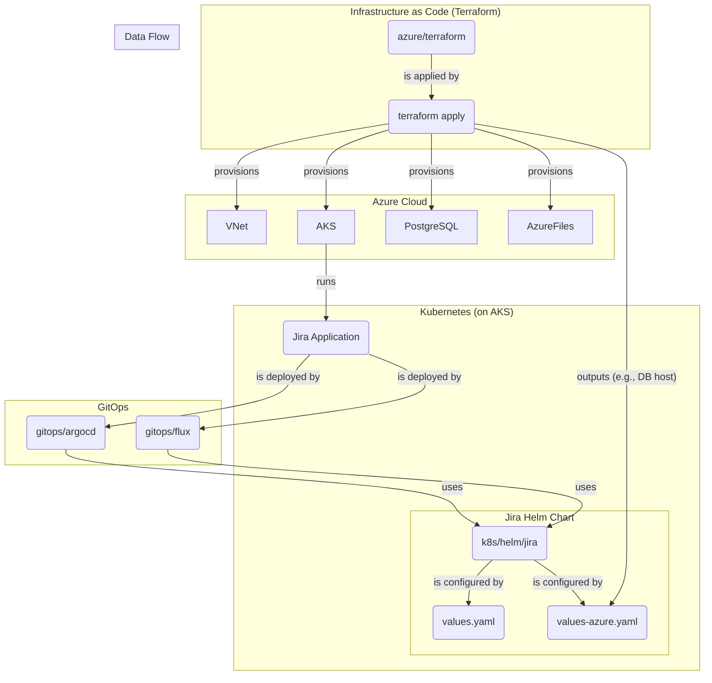

# Jira on Azure AKS – Reference Notes

This folder sketches how to adapt the AWS/EKS reference to Azure services for a system design interview or a POC. It now includes a Terraform skeleton (`azure/terraform`) plus Helm overrides for AKS (`k8s/helm/jira/values-azure.yaml`).

## High-Level Architecture

The diagram below illustrates the deployment architecture for Jira on Azure. Terraform provisions the core infrastructure, and then GitOps (ArgoCD/Flux) or a manual Helm deployment is used to deploy the Jira application to the AKS cluster.



## Service mapping
- Kubernetes: **AKS** (multi-AZ node pools).
- Database: **Azure Database for PostgreSQL (Flexible Server)** with zone redundancy and automated backups.
- Shared home: **Azure Files Premium** (NFS) or **Azure NetApp Files** for higher throughput.
- Ingress & TLS: **Application Gateway** or **Azure Front Door**, certificates in **Key Vault**.
- DNS: **Azure DNS** for `jira.company.com`.
- Secrets: **Key Vault** surfaced into AKS via **CSI Secret Store**.
- Observability: **Azure Monitor / Log Analytics** for logs and metrics; optional Prometheus/Grafana add-on.

## Outline to stand up a minimal POC
1) Create a resource group and virtual network with private subnets (Terraform module: `azure/terraform/network`).  
2) Provision AKS with a system node pool and enable OIDC/workload identity (module: `azure/terraform/aks`).  
3) Enable Application Gateway Ingress Controller (AGIC) or deploy NGINX Ingress with an Application Gateway behind it (subnet is created by `azure/terraform/network`).  
4) Provision PostgreSQL Flexible Server with private access and HA (module: `azure/terraform/postgres`).  
5) Provision Azure Files Premium for the Jira shared home (module: `azure/terraform/storage`).  
6) Deploy the Jira Helm chart with the Azure override file (`k8s/helm/jira/values-azure.yaml`) via Helm or GitOps (Argo CD/Flux examples under `gitops/`).

## How to use the Terraform skeleton

This Terraform setup uses a remote backend to store the state file in Azure Storage. This is a best practice for collaborative environments and CI/CD automation.

### Backend Configuration (One-time setup)

Before you can run Terraform, you need to create a storage account and a container to hold the state file. You can do this using the Azure CLI:

```bash
# Variables
BACKEND_RG="jira-tf-state-rg"
BACKEND_STORAGE_ACCOUNT="jiratfstate$RANDOM"
BACKEND_CONTAINER="tfstate"
LOCATION="eastus"

# Create resource group
az group create --name $BACKEND_RG --location $LOCATION

# Create storage account
az storage account create --name $BACKEND_STORAGE_ACCOUNT --resource-group $BACKEND_RG --location $LOCATION --sku Standard_LRS --encryption-services blob

# Create blob container
az storage container create --name $BACKEND_CONTAINER --account-name $BACKEND_STORAGE_ACCOUNT
```

### Initializing Terraform

Once the backend storage is created, you can initialize Terraform. The configuration is passed during the `init` command, not stored in the code, for better security and flexibility.

```bash
cd azure/terraform

terraform init \
    -backend-config="resource_group_name=$BACKEND_RG" \
    -backend-config="storage_account_name=$BACKEND_STORAGE_ACCOUNT" \
    -backend-config="container_name=$BACKEND_CONTAINER" \
    -backend-config="key=jira.prod.tfstate"
```

### Applying the plan

After initialization, you can apply the Terraform plan. You will need to provide your current public IP address for the `admin_ip_address` variable to allow SSH access to the AKS nodes.

```bash
terraform apply \
  -var="resource_group_name=jira-rg" \
  -var="postgres_admin_password=change-me" \
  -var="location=eastus" \
  -var="admin_ip_address=<YOUR_PUBLIC_IP>"
```

Key outputs:
- `aks_kubeconfig` (raw kubeconfig for `kubectl`/Helm)
- `postgres_fqdn` (Flexible Server endpoint)
- `storage_share_name` (shared home on Azure Files)

## Helm overrides for AKS
- Base chart: `k8s/helm/jira/values.yaml`
- Azure overlay: `k8s/helm/jira/values-azure.yaml` (ingress annotations for AGIC and Azure Files backend)

Example:
```bash
cd k8s/helm/jira
helm upgrade --install jira . \
  -n jira-prod --create-namespace \
  -f values.yaml -f values-azure.yaml
```

## GitOps options
- Argo CD application: `gitops/argocd/jira-app.yaml`
- Flux HelmRelease: `gitops/flux/jira-helmrelease.yaml` (with `kustomization.yaml`)

Apply them from your management cluster after adjusting repo URL/branch and secrets.

## Permissions

The Terraform configuration now includes an Azure Key Vault to manage the PostgreSQL password. The user or service principal running `terraform apply` will have an access policy automatically added to the Key Vault to manage secrets. This is handled by the `keyvault` module, which uses the `azurerm_client_config` data source to get the `object_id` of the caller.

## Code Review and Recommendations

The Terraform code in `azure/terraform` provides a solid foundation for provisioning the necessary infrastructure for Jira on Azure. Here are some observations and recommendations:

*   **Good Separation of Concerns:** The project correctly separates infrastructure provisioning (Terraform) from application deployment (Helm/GitOps). This is a best practice that allows for independent management of each layer.
*   **Modular Terraform:** The use of Terraform modules for different components (network, AKS, PostgreSQL, storage, keyvault) is a good practice. This makes the code more organized, reusable, and easier to maintain.
*   **Secrets Management:** The PostgreSQL password is now managed by Azure Key Vault. The `postgres_admin_password` variable is only used to set the initial secret in the vault. The PostgreSQL module then retrieves the secret directly from Key Vault. This is a secure approach that avoids passing secrets in plaintext.
*   **Manual Configuration Step:** A key part of the process is manually updating `k8s/helm/jira/values-azure.yaml` with the outputs from the Terraform deployment (like the PostgreSQL FQDN). This is a potential source of human error.
    *   **Recommendation:** To improve this, consider using a tool or script to automate the injection of Terraform outputs into the Helm values file. For example, you could use a simple `sed` command in a script, or a more advanced tool like `terragrunt` or a custom CI/CD job to handle this automatically.
*   **State File Management:** The setup now uses a remote backend for the Terraform state file, which is a best practice for collaboration and CI/CD.

By addressing these recommendations, the project can be made more robust, secure, and easier to manage in a team environment.
