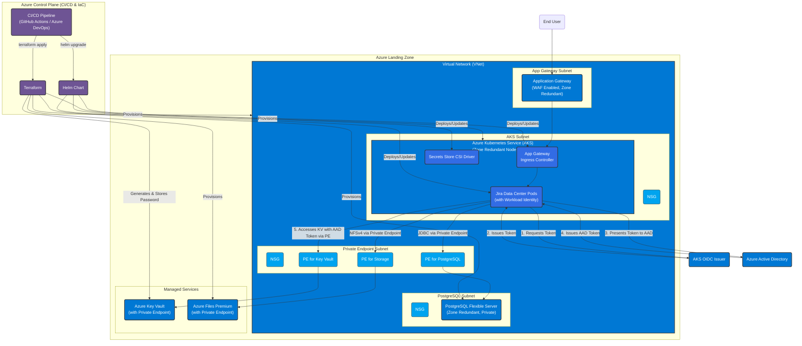

# Jira on Azure AKS – Reference Notes

This folder sketches how to adapt the AWS/EKS reference to Azure services for a system design interview or a POC. It now includes a Terraform skeleton (`azure/terraform`) plus Helm overrides for AKS (`k8s/helm/jira/values-azure.yaml`).

## Proposed FAANG-Level Architecture

The diagram below illustrates a more robust and secure "FAANG-level" architecture for Jira on Azure. This design emphasizes security, scalability, and operational best practices.

*__Key Improvements:__*
- **Zero Trust Networking:** All Azure services (PostgreSQL, Key Vault, Storage) are accessed via **Private Endpoints**, eliminating any public internet exposure. The current Terraform code sets up the VNet integration but requires enabling private endpoints in the respective modules.
- **Automated Secrets:** The PostgreSQL password is now **generated automatically** by Terraform and stored directly in Key Vault, removing the need for manual secret management and improving security.
- **Granular Identity:** AKS pods use **Workload Identity** to securely access Key Vault secrets at runtime, following the principle of least privilege.
- **Network Security:** **Network Security Groups (NSGs)** enforce strict traffic rules between all subnets.



## Service mapping
- Kubernetes: **AKS** (multi-AZ node pools).
- Database: **Azure Database for PostgreSQL (Flexible Server)** with zone redundancy and automated backups.
- Shared home: **Azure Files Premium** (NFS) or **Azure NetApp Files** for higher throughput.
- Ingress & TLS: **Application Gateway** or **Azure Front Door**, certificates in **Key Vault**.
- DNS: **Azure DNS** for `jira.company.com`.
- Secrets: **Key Vault** surfaced into AKS via **CSI Secret Store**.
- Observability: **Azure Monitor / Log Analytics** for logs and metrics; optional Prometheus/Grafana add-on.

## Zero-to-hero (AKS + GitOps)
1) **State** – Create the remote backend (see “Backend Configuration”). The PostgreSQL password is now generated and stored in Key Vault automatically.  
2) **Provision infra** – From `azure/terraform`, run `terraform init` (with backend config) then `terraform apply` with `resource_group_name`, `location`, and `admin_ip_address`. This stands up VNet/subnets, AKS (OIDC/workload identity), PostgreSQL Flexible Server (private + HA), Azure Files Premium, Key Vault (with a generated password), and Log Analytics.  
3) **Capture outputs** – `aks_kubeconfig` (for `kubectl`/Helm and for `KUBECONFIG_B64` in CI), `postgres_fqdn`, `storage_share_name`. The database password is not outputted for security, but can be retrieved from Key Vault if needed for break-glass scenarios.
4) **Deploy Jira** – Helm with `values.yaml` + `values-azure.yaml`, or GitOps:
   - Argo CD: apply `gitops/argocd/jira-app.yaml` (update repo URL/branch).
   - Flux: apply `gitops/flux/kustomization.yaml` and `jira-helmrelease.yaml`.
   - CI templates: `gitops/pipelines/` for GitHub Actions, Azure DevOps, GitLab (set `GITOPS_TOOL` and `KUBECONFIG_B64` secrets).

## How to use the Terraform skeleton

This Terraform setup uses a remote backend to store the state file in Azure Storage. This is a best practice for collaborative environments and CI/CD automation.

### Backend Configuration (One-time setup)

Before you can run Terraform, you need to create a storage account and a container to hold the state file. You can do this using the Azure CLI:

```bash
# Variables
BACKEND_RG="jira-tf-state-rg"
BACKEND_STORAGE_ACCOUNT="jiratfstate$RANDOM"
BACKEND_CONTAINER="tfstate"
LOCATION="eastus"

# Create resource group
az group create --name $BACKEND_RG --location $LOCATION

# Create storage account
az storage account create --name $BACKEND_STORAGE_ACCOUNT --resource-group $BACKEND_RG --location $LOCATION --sku Standard_LRS --encryption-services blob

# Create blob container
az storage container create --name $BACKEND_CONTAINER --account-name $BACKEND_STORAGE_ACCOUNT
```

### Initializing Terraform

Once the backend storage is created, you can initialize Terraform. The configuration is passed during the `init` command, not stored in the code, for better security and flexibility.

```bash
cd azure/terraform

terraform init \
    -backend-config="resource_group_name=$BACKEND_RG" \
    -backend-config="storage_account_name=$BACKEND_STORAGE_ACCOUNT" \
    -backend-config="container_name=$BACKEND_CONTAINER" \
    -backend-config="key=jira.prod.tfstate"
```

### Applying the plan

After initialization, you can apply the Terraform plan. You will need to provide your current public IP address for the `admin_ip_address` variable to allow management access. The PostgreSQL admin password is now generated automatically.

```bash
terraform apply \
  -var="resource_group_name=jira-rg" \
  -var="location=eastus" \
  -var="admin_ip_address=<YOUR_PUBLIC_IP>"
```

Key outputs:
- `aks_kubeconfig` (raw kubeconfig for `kubectl`/Helm)
- `postgres_fqdn` (Flexible Server endpoint)
- `storage_share_name` (shared home on Azure Files)

## Proposed FAANG-Level Refinements

This repository provides a strong foundation. To elevate it to a true enterprise-grade, "FAANG-level" standard, consider the following improvements.

### 1. Automate Password & Secret Management (Implemented)
- **Status:** **Done**.
- **Change:** The initial design required passing the PostgreSQL password as a Terraform variable, which is a security risk. The `keyvault` module has been refactored to use the `random_password` resource to automatically generate a strong password and store it directly in the Key Vault secret.
- **Benefit:** This eliminates secret-zero handling from the user/CI system, prevents passwords from being stored in state files or logs, and rotates passwords on every infrastructure recreation.

### 2. Implement True Zero-Trust Networking
- **Status:** **Partially Implemented**. The subnets are created, but private endpoints are not yet enabled in the modules.
- **Change:** Each module (`postgres`, `storage`, `keyvault`) should be updated to create a Private Endpoint in the dedicated `PeSubnet`. The services should be configured to deny all public traffic, only allowing connections from the private endpoint.
- **Benefit:** This completely isolates your data services from the public internet, drastically reducing the attack surface. It is a foundational principle for modern cloud security.

### 3. Decouple Environments with Workspaces or Terragrunt
- **Status:** **Not Started**.
- **Change:** The current `main.tf` hardcodes the environment tag (`env = "prod"`). Use Terraform workspaces (`terraform.workspace`) to dynamically set tags, resource prefixes, and select different `.tfvars` files (e.g., `dev.tfvars`, `prod.tfvars`). For more complex scenarios, adopt a tool like Terragrunt to keep environment configurations DRY (Don't Repeat Yourself).
- **Benefit:** Enables safe, repeatable deployments of multiple environments (dev, staging, prod) from the same codebase without duplication.

### 4. Enhance CI/CD Automation
- **Status:** **Not Started**.
- **Change:** The `deploy-production.sh` script is a good starting point but isn't a robust CI/CD pipeline. Create a multi-stage YAML pipeline in GitHub Actions or Azure DevOps that includes:
    - **Lint & Validate:** `terraform fmt -check` and `terraform validate`.
    - **Plan:** `terraform plan` with an output file.
    - **Manual Approval:** A gate for production deployments.
    - **Apply:** `terraform apply` using the plan file.
- **Benefit:** Provides auditability, safety, and fully automated, hands-off deployments.

### 5. Granular Permissions with Workload Identity
- **Status:** **Foundation is in place**.
- **Change:** The AKS cluster is enabled for Workload Identity. The next step is to define specific managed identities for different applications within the cluster. For example, the Jira pods would have a dedicated identity with a policy that *only* grants `Get` and `List` permissions on specific secrets in Key Vault, rather than giving the node itself broad permissions.
- **Benefit:** Enforces the principle of least privilege at the pod level, which is a significant security enhancement over node-level permissions.

