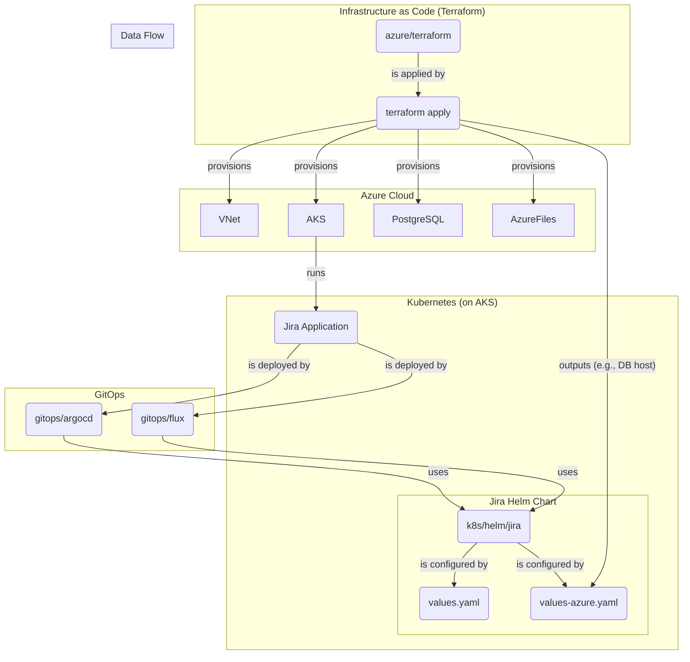

# Jira on Azure AKS – Reference Notes

This folder sketches how to adapt the AWS/EKS reference to Azure services for a system design interview or a POC. It now includes a Terraform skeleton (`azure/terraform`) plus Helm overrides for AKS (`k8s/helm/jira/values-azure.yaml`).

## High-Level Architecture

The diagram below illustrates the deployment architecture for Jira on Azure. Terraform provisions the core infrastructure, and then GitOps (ArgoCD/Flux) or a manual Helm deployment is used to deploy the Jira application to the AKS cluster.



## Service mapping
- Kubernetes: **AKS** (multi-AZ node pools).
- Database: **Azure Database for PostgreSQL (Flexible Server)** with zone redundancy and automated backups.
- Shared home: **Azure Files Premium** (NFS) or **Azure NetApp Files** for higher throughput.
- Ingress & TLS: **Application Gateway** or **Azure Front Door**, certificates in **Key Vault**.
- DNS: **Azure DNS** for `jira.company.com`.
- Secrets: **Key Vault** surfaced into AKS via **CSI Secret Store**.
- Observability: **Azure Monitor / Log Analytics** for logs and metrics; optional Prometheus/Grafana add-on.

## Outline to stand up a minimal POC
1) Create a resource group and virtual network with private subnets (Terraform module: `azure/terraform/network`).  
2) Provision AKS with a system node pool and enable OIDC/workload identity (module: `azure/terraform/aks`).  
3) Enable Application Gateway Ingress Controller (AGIC) or deploy NGINX Ingress with an Application Gateway behind it (subnet is created by `azure/terraform/network`).  
4) Provision PostgreSQL Flexible Server with private access and HA (module: `azure/terraform/postgres`).  
5) Provision Azure Files Premium for the Jira shared home (module: `azure/terraform/storage`).  
6) Deploy the Jira Helm chart with the Azure override file (`k8s/helm/jira/values-azure.yaml`) via Helm or GitOps (Argo CD/Flux examples under `gitops/`).

## How to use the Terraform skeleton
```bash
cd azure/terraform
terraform init
terraform apply \
  -var="resource_group_name=jira-rg" \
  -var="postgres_admin_password=change-me" \
  -var="location=eastus"
```

Key outputs:
- `aks_kubeconfig` (raw kubeconfig for `kubectl`/Helm)
- `postgres_fqdn` (Flexible Server endpoint)
- `storage_share_name` (shared home on Azure Files)

## Helm overrides for AKS
- Base chart: `k8s/helm/jira/values.yaml`
- Azure overlay: `k8s/helm/jira/values-azure.yaml` (ingress annotations for AGIC and Azure Files backend)

Example:
```bash
cd k8s/helm/jira
helm upgrade --install jira . \
  -n jira-prod --create-namespace \
  -f values.yaml -f values-azure.yaml
```

## GitOps options
- Argo CD application: `gitops/argocd/jira-app.yaml`
- Flux HelmRelease: `gitops/flux/jira-helmrelease.yaml` (with `kustomization.yaml`)

Apply them from your management cluster after adjusting repo URL/branch and secrets.

## Code Review and Recommendations

The Terraform code in `azure/terraform` provides a solid foundation for provisioning the necessary infrastructure for Jira on Azure. Here are some observations and recommendations:

*   **Good Separation of Concerns:** The project correctly separates infrastructure provisioning (Terraform) from application deployment (Helm/GitOps). This is a best practice that allows for independent management of each layer.
*   **Modular Terraform:** The use of Terraform modules for different components (network, AKS, PostgreSQL, storage) is a good practice. This makes the code more organized, reusable, and easier to maintain.
*   **Manual Configuration Step:** A key part of the process is manually updating `k8s/helm/jira/values-azure.yaml` with the outputs from the Terraform deployment (like the PostgreSQL FQDN). This is a potential source of human error.
    *   **Recommendation:** To improve this, consider using a tool or script to automate the injection of Terraform outputs into the Helm values file. For example, you could use a simple `sed` command in a script, or a more advanced tool like `terragrunt` or a custom CI/CD job to handle this automatically.
*   **Secrets Management:** The example `terraform apply` command shows passing the PostgreSQL password as a command-line variable. This is not secure as it can be stored in shell history.
    *   **Recommendation:** Use a more secure method for managing secrets. For production, use a secrets management tool like Azure Key Vault. For local development, use a `.tfvars` file that is added to `.gitignore`, or set the variable as an environment variable (`TF_VAR_postgres_admin_password`).
*   **State File Management:** The current setup appears to store the Terraform state file locally. For a collaborative or production environment, this is not ideal.
    *   **Recommendation:** Configure a remote backend for the Terraform state file, such as an Azure Storage Account. This provides locking to prevent concurrent modifications and ensures that the state is accessible to all team members and CI/CD pipelines.

By addressing these recommendations, the project can be made more robust, secure, and easier to manage in a team environment.
