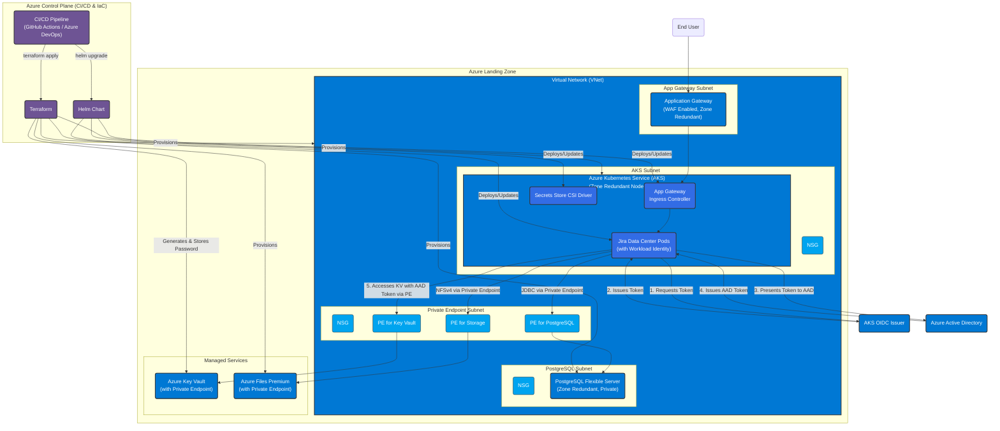

## Proposed FAANG-Level Architecture

The diagram below illustrates a more robust and secure "FAANG-level" architecture for Jira on Azure. This design emphasizes security, scalability, and operational best practices.

*__Key Improvements:__*
- **Zero Trust Networking:** All Azure services (PostgreSQL, Key Vault, Storage) are accessed via **Private Endpoints**, eliminating any public internet exposure.
- **Automated Secrets:** The PostgreSQL password is now **generated automatically** by Terraform and stored directly in Key Vault, removing the need for manual secret management.
- **Granular Identity:** AKS pods use **Workload Identity** to securely access Key Vault secrets at runtime, following the principle of least privilege.
- **Network Security:** **Network Security Groups (NSGs)** enforce strict traffic rules between all subnets.

