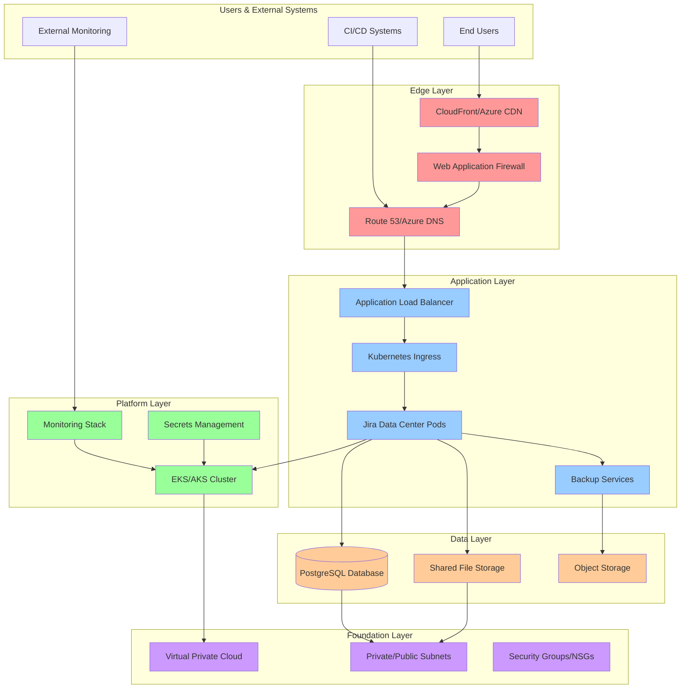
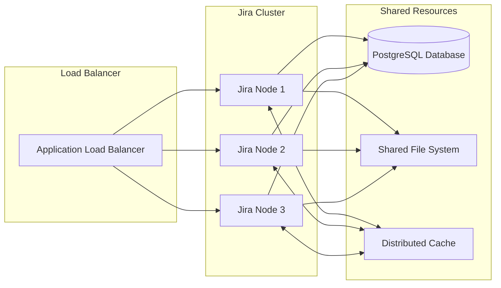
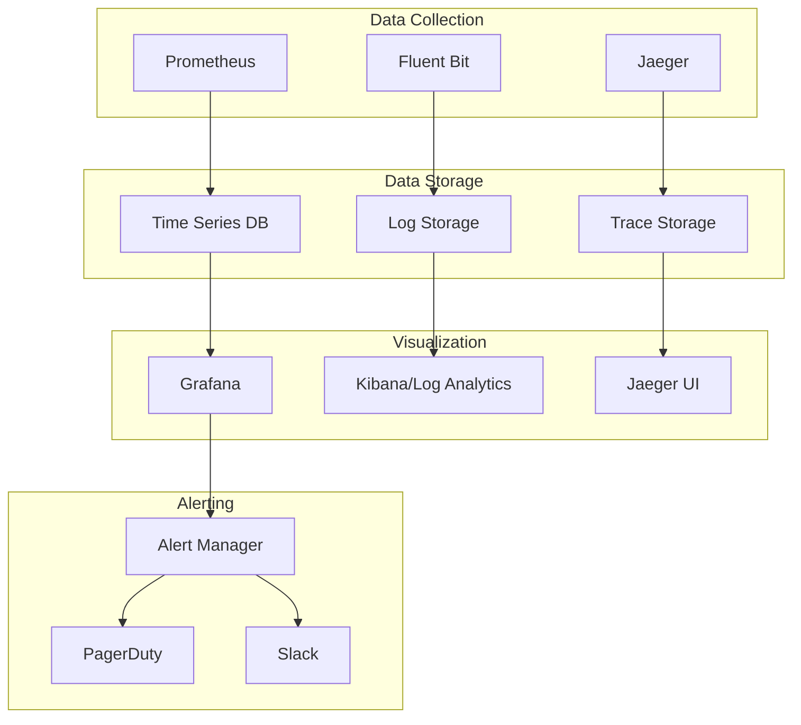

# Architecture Deep Dive: Enterprise Jira on Kubernetes

*A comprehensive guide to designing resilient, scalable Jira deployments*

## Table of Contents

1. [System Architecture](#system-architecture)
2. [Infrastructure Patterns](#infrastructure-patterns)
3. [Application Architecture](#application-architecture)
4. [Data Architecture](#data-architecture)
5. [Security Architecture](#security-architecture)
6. [Observability Architecture](#observability-architecture)
7. [Deployment Patterns](#deployment-patterns)
8. [Scaling Strategies](#scaling-strategies)

## System Architecture

### Layered Architecture Pattern

Our reference implementation follows a **three-tier layered architecture** that provides clear separation of concerns and enables independent team workflows:



### Design Principles

**1. Fault Isolation**
- Each layer can fail independently without cascading failures
- Circuit breakers prevent resource exhaustion
- Bulkhead pattern isolates critical vs. non-critical workloads

**2. Scalability by Design**
- Horizontal scaling at every layer
- Stateless application design with shared storage
- Auto-scaling based on multiple metrics

**3. Security in Depth**
- Multiple security boundaries (network, application, data)
- Principle of least privilege access
- Encryption at rest and in transit

**4. Operational Excellence**
- Infrastructure as Code for all components
- Comprehensive monitoring and alerting
- Automated backup and disaster recovery

## Infrastructure Patterns

### Multi-Cloud Abstraction

Our infrastructure uses **provider-agnostic patterns** that work across AWS and Azure:

#### AWS Implementation

```hcl
# Foundation Layer - VPC and Base Security
module "foundation" {
  source = "./foundation"
  
  vpc_cidr = "10.0.0.0/16"
  availability_zones = ["us-east-1a", "us-east-1b", "us-east-1c"]
  
  tags = {
    Environment = "production"
    Application = "jira"
  }
}

# Platform Layer - EKS and Shared Services
module "platform" {
  source = "./platform"
  
  foundation_outputs = module.foundation.outputs
  
  eks_config = {
    version = "1.30"
    node_groups = {
      system = {
        instance_types = ["m5.large"]
        min_size = 2
        max_size = 5
      }
      jira = {
        instance_types = ["m5.2xlarge"]
        min_size = 3
        max_size = 10
      }
    }
  }
}
```

#### Azure Implementation

```hcl
# Foundation Layer - VNet and Base Security
module "foundation" {
  source = "./foundation"
  
  vnet_cidr = "10.20.0.0/16"
  availability_zones = ["1", "2", "3"]
  
  tags = {
    Environment = "production"
    Application = "jira"
  }
}

# Platform Layer - AKS and Shared Services
module "platform" {
  source = "./platform"
  
  foundation_outputs = module.foundation.outputs
  
  aks_config = {
    kubernetes_version = "1.30.3"
    node_pools = {
      system = {
        vm_size = "Standard_D4s_v5"
        min_count = 2
        max_count = 5
      }
      jira = {
        vm_size = "Standard_D8s_v5"
        min_count = 3
        max_count = 10
      }
    }
  }
}
```

### State Management Strategy

**Problem**: Monolithic Terraform state creates deployment bottlenecks and increases blast radius.

**Solution**: Layered state management with remote backends.

```bash
# Foundation state
terraform init -backend-config="key=foundation/terraform.tfstate"

# Platform state (depends on foundation)
terraform init -backend-config="key=platform/terraform.tfstate"

# Application state (depends on platform)
terraform init -backend-config="key=application/terraform.tfstate"
```

**Benefits**:
- **Parallel Development**: Teams can work on different layers simultaneously
- **Reduced Blast Radius**: Changes to one layer don't affect others
- **Faster Deployments**: Only changed layers need to be applied
- **Better Security**: Different teams can have access to different layers

## Application Architecture

### Jira Data Center Clustering

Jira Data Center provides **active-active clustering** for high availability and horizontal scaling:



### Container Design

**Base Image Hardening**:
```dockerfile
# Multi-stage build for security
FROM atlassian/jira-software:9.0.0 as base

# Security hardening
RUN groupadd -r jira && useradd -r -g jira jira
RUN chown -R jira:jira /var/atlassian/application-data/jira

# Remove unnecessary packages
RUN apt-get update && apt-get remove -y \
    curl wget netcat && \
    apt-get autoremove -y && \
    rm -rf /var/lib/apt/lists/*

USER jira
```

**Resource Management**:
```yaml
# Production resource configuration
resources:
  requests:
    cpu: "2"
    memory: "8Gi"
    ephemeral-storage: "10Gi"
  limits:
    cpu: "4"
    memory: "16Gi"
    ephemeral-storage: "20Gi"

# JVM tuning for containerized environments
env:
- name: JVM_MINIMUM_MEMORY
  value: "8g"
- name: JVM_MAXIMUM_MEMORY
  value: "12g"
- name: JVM_SUPPORT_RECOMMENDED_ARGS
  value: "-XX:+UseG1GC -XX:+UseStringDeduplication"
```

### Health Check Strategy

**Multi-Level Health Checks**:

```yaml
# Startup probe - allows 5 minutes for application initialization
startupProbe:
  httpGet:
    path: /status
    port: 8080
  initialDelaySeconds: 30
  periodSeconds: 10
  timeoutSeconds: 5
  failureThreshold: 30

# Liveness probe - detects hung processes
livenessProbe:
  httpGet:
    path: /status
    port: 8080
  initialDelaySeconds: 120
  periodSeconds: 30
  timeoutSeconds: 10
  failureThreshold: 3

# Readiness probe - controls traffic routing
readinessProbe:
  httpGet:
    path: /status
    port: 8080
  initialDelaySeconds: 60
  periodSeconds: 10
  timeoutSeconds: 5
  failureThreshold: 3
```

## Data Architecture

### Database Design

**PostgreSQL Configuration for Jira**:

```sql
-- Connection and memory settings
max_connections = 200
shared_buffers = 4GB
effective_cache_size = 12GB
work_mem = 64MB
maintenance_work_mem = 1GB

-- Write-ahead logging for durability
wal_buffers = 64MB
checkpoint_completion_target = 0.9
max_wal_size = 4GB

-- Query optimization
random_page_cost = 1.1
effective_io_concurrency = 200

-- Monitoring and logging
log_min_duration_statement = 1000
log_checkpoints = on
log_connections = on
log_disconnections = on
```

**Backup Strategy**:

```yaml
# Automated backup configuration
apiVersion: batch/v1
kind: CronJob
metadata:
  name: jira-database-backup
spec:
  schedule: "0 2 * * *"  # Daily at 2 AM
  jobTemplate:
    spec:
      template:
        spec:
          containers:
          - name: pg-dump
            image: postgres:15
            command:
            - /bin/bash
            - -c
            - |
              pg_dump -h $DB_HOST -U $DB_USER -d $DB_NAME \
                --verbose --no-password --format=custom \
                --file=/backup/jira-$(date +%Y%m%d-%H%M%S).dump
              
              # Upload to S3/Azure Storage
              aws s3 cp /backup/ s3://jira-backups/ --recursive
            env:
            - name: PGPASSWORD
              valueFrom:
                secretKeyRef:
                  name: jira-db-secret
                  key: password
```

### Storage Architecture

**Shared File System Design**:

```yaml
# EFS/Azure Files configuration
apiVersion: v1
kind: PersistentVolume
metadata:
  name: jira-shared-home
spec:
  capacity:
    storage: 1Ti
  accessModes:
    - ReadWriteMany
  persistentVolumeReclaimPolicy: Retain
  storageClassName: efs-sc
  csi:
    driver: efs.csi.aws.com
    volumeHandle: fs-xxxxxxxx
    volumeAttributes:
      provisioningMode: efs-ap
      directoryPerms: "0755"
      gidRangeStart: "2000"
      gidRangeEnd: "2001"
```

**Performance Optimization**:

```bash
# EFS performance mode
Creation Token: jira-shared-home
Performance Mode: General Purpose
Throughput Mode: Provisioned (500 MiB/s)
Encryption: Enabled (AES-256)

# Mount options for optimal performance
mount -t efs -o tls,regional fs-xxxxxxxx.efs.us-east-1.amazonaws.com:/ /mnt/efs
```

## Security Architecture

### Network Security

**Zero Trust Network Model**:

```yaml
# Network policy for micro-segmentation
apiVersion: networking.k8s.io/v1
kind: NetworkPolicy
metadata:
  name: jira-network-policy
spec:
  podSelector:
    matchLabels:
      app: jira
  policyTypes:
  - Ingress
  - Egress
  
  # Ingress rules - only allow specific sources
  ingress:
  - from:
    # Allow ingress controller
    - namespaceSelector:
        matchLabels:
          name: ingress-nginx
    # Allow monitoring
    - namespaceSelector:
        matchLabels:
          name: monitoring
    ports:
    - protocol: TCP
      port: 8080
  
  # Egress rules - principle of least privilege
  egress:
  # DNS resolution
  - to: []
    ports:
    - protocol: UDP
      port: 53
  # Database access
  - to:
    - namespaceSelector:
        matchLabels:
          name: database
    ports:
    - protocol: TCP
      port: 5432
  # HTTPS for external APIs
  - to: []
    ports:
    - protocol: TCP
      port: 443
```

### Identity and Access Management

**RBAC Configuration**:

```yaml
# Service account for Jira pods
apiVersion: v1
kind: ServiceAccount
metadata:
  name: jira-service-account
  annotations:
    eks.amazonaws.com/role-arn: arn:aws:iam::ACCOUNT:role/JiraServiceRole

---
# Role for Jira operations
apiVersion: rbac.authorization.k8s.io/v1
kind: Role
metadata:
  name: jira-role
rules:
- apiGroups: [""]
  resources: ["configmaps", "secrets"]
  verbs: ["get", "list", "watch"]
- apiGroups: [""]
  resources: ["pods"]
  verbs: ["get", "list", "watch", "create", "delete"]

---
# Bind role to service account
apiVersion: rbac.authorization.k8s.io/v1
kind: RoleBinding
metadata:
  name: jira-role-binding
subjects:
- kind: ServiceAccount
  name: jira-service-account
roleRef:
  kind: Role
  name: jira-role
  apiGroup: rbac.authorization.k8s.io
```

### Secrets Management

**External Secrets Integration**:

```yaml
# External secret for database credentials
apiVersion: external-secrets.io/v1beta1
kind: ExternalSecret
metadata:
  name: jira-db-secret
spec:
  refreshInterval: 1h
  secretStoreRef:
    name: aws-secrets-manager
    kind: SecretStore
  target:
    name: jira-db-secret
    creationPolicy: Owner
  data:
  - secretKey: username
    remoteRef:
      key: jira/database
      property: username
  - secretKey: password
    remoteRef:
      key: jira/database
      property: password
```

## Observability Architecture

### Monitoring Stack

**Three Pillars of Observability**:

1. **Metrics** (Prometheus + Grafana)
2. **Logs** (Fluent Bit + CloudWatch/Azure Monitor)
3. **Traces** (Jaeger + OpenTelemetry)



### Key Metrics and SLIs

**Service Level Indicators (SLIs)**:

```yaml
# Availability SLI
availability_sli:
  query: |
    sum(rate(http_requests_total{job="jira",code!~"5.."}[5m])) /
    sum(rate(http_requests_total{job="jira"}[5m]))
  target: 0.999  # 99.9% availability

# Latency SLI
latency_sli:
  query: |
    histogram_quantile(0.95, 
      sum(rate(http_request_duration_seconds_bucket{job="jira"}[5m])) by (le)
    )
  target: 2.0  # 95th percentile < 2 seconds

# Error Rate SLI
error_rate_sli:
  query: |
    sum(rate(http_requests_total{job="jira",code=~"5.."}[5m])) /
    sum(rate(http_requests_total{job="jira"}[5m]))
  target: 0.001  # Error rate < 0.1%
```

### Alerting Strategy

**Alert Hierarchy**:

```yaml
# Critical alerts - immediate response required
- alert: JiraDown
  expr: up{job="jira"} == 0
  for: 1m
  labels:
    severity: critical
    team: platform
  annotations:
    summary: "Jira instance is down"
    runbook: "https://runbooks.company.com/jira-down"

# Warning alerts - investigate within business hours
- alert: JiraHighLatency
  expr: |
    histogram_quantile(0.95, 
      sum(rate(http_request_duration_seconds_bucket{job="jira"}[5m])) by (le)
    ) > 5
  for: 5m
  labels:
    severity: warning
    team: application
  annotations:
    summary: "Jira response time is high"
    description: "95th percentile latency is {{ $value }}s"
```

## Deployment Patterns

### GitOps Workflow

**Branch Strategy**:

```
main branch (production)
├── develop branch (staging)
├── feature/new-monitoring (development)
└── hotfix/security-patch (emergency)
```

**ArgoCD Application**:

```yaml
apiVersion: argoproj.io/v1alpha1
kind: Application
metadata:
  name: jira-production
  namespace: argocd
spec:
  project: default
  source:
    repoURL: https://github.com/company/jira-k8s
    targetRevision: main
    path: k8s/helm/jira
    helm:
      valueFiles:
      - values-prod.yaml
  destination:
    server: https://kubernetes.default.svc
    namespace: jira-prod
  syncPolicy:
    automated:
      prune: true
      selfHeal: true
    syncOptions:
    - CreateNamespace=true
    retry:
      limit: 5
      backoff:
        duration: 5s
        factor: 2
        maxDuration: 3m
```

### Blue-Green Deployments

**Zero-Downtime Updates**:

```bash
#!/bin/bash
# Blue-Green deployment script

# Deploy to green environment
helm upgrade jira-green ./k8s/helm/jira \
  --namespace jira-green \
  --values values-prod.yaml \
  --set image.tag=$NEW_VERSION

# Health check
kubectl wait --for=condition=ready pod \
  -l app=jira -n jira-green --timeout=300s

# Smoke tests
kubectl run smoke-test --image=curlimages/curl --rm -it -- \
  curl -f http://jira-green.jira-green.svc.cluster.local:8080/status

# Switch traffic
kubectl patch ingress jira -n jira-prod -p '{
  "spec": {
    "rules": [{
      "host": "jira.company.com",
      "http": {
        "paths": [{
          "path": "/",
          "pathType": "Prefix",
          "backend": {
            "service": {
              "name": "jira-green",
              "port": {"number": 8080}
            }
          }
        }]
      }
    }]
  }
}'

# Cleanup old version after validation
helm uninstall jira-blue -n jira-blue
```

## Scaling Strategies

### Horizontal Pod Autoscaling

**Multi-Metric HPA**:

```yaml
apiVersion: autoscaling/v2
kind: HorizontalPodAutoscaler
metadata:
  name: jira-hpa
spec:
  scaleTargetRef:
    apiVersion: apps/v1
    kind: Deployment
    name: jira
  minReplicas: 3
  maxReplicas: 10
  
  # Multiple scaling metrics
  metrics:
  - type: Resource
    resource:
      name: cpu
      target:
        type: Utilization
        averageUtilization: 70
  - type: Resource
    resource:
      name: memory
      target:
        type: Utilization
        averageUtilization: 80
  - type: Pods
    pods:
      metric:
        name: jira_active_sessions
      target:
        type: AverageValue
        averageValue: "100"
  
  # Scaling behavior
  behavior:
    scaleDown:
      stabilizationWindowSeconds: 300
      policies:
      - type: Percent
        value: 10
        periodSeconds: 60
    scaleUp:
      stabilizationWindowSeconds: 60
      policies:
      - type: Percent
        value: 50
        periodSeconds: 60
```

### Cluster Autoscaling

**Node Group Configuration**:

```yaml
# EKS Node Group with mixed instance types
apiVersion: eksctl.io/v1alpha5
kind: ClusterConfig
metadata:
  name: jira-cluster
  region: us-east-1

nodeGroups:
- name: jira-nodes
  instancesDistribution:
    maxPrice: 0.50
    instanceTypes:
    - m5.2xlarge
    - m5a.2xlarge
    - m5n.2xlarge
    onDemandBaseCapacity: 2
    onDemandPercentageAboveBaseCapacity: 25
    spotInstancePools: 3
  
  minSize: 3
  maxSize: 20
  desiredCapacity: 5
  
  # Taints for Jira workloads
  taints:
  - key: jira-workload
    value: "true"
    effect: NoSchedule
  
  # Labels for node selection
  labels:
    workload-type: jira
    instance-lifecycle: mixed
```

### Database Scaling

**Read Replica Configuration**:

```hcl
# Aurora cluster with read replicas
resource "aws_rds_cluster" "jira" {
  cluster_identifier = "jira-cluster"
  engine            = "aurora-postgresql"
  engine_version    = "15.4"
  
  # Writer instance
  master_username = var.db_username
  master_password = var.db_password
  
  # Backup configuration
  backup_retention_period = 30
  preferred_backup_window = "03:00-04:00"
  
  # Performance insights
  enabled_cloudwatch_logs_exports = ["postgresql"]
  
  tags = var.tags
}

# Writer instance
resource "aws_rds_cluster_instance" "jira_writer" {
  identifier         = "jira-writer"
  cluster_identifier = aws_rds_cluster.jira.id
  instance_class     = "db.r6g.2xlarge"
  engine             = aws_rds_cluster.jira.engine
  
  performance_insights_enabled = true
  monitoring_interval         = 60
}

# Read replica instances
resource "aws_rds_cluster_instance" "jira_reader" {
  count              = 2
  identifier         = "jira-reader-${count.index + 1}"
  cluster_identifier = aws_rds_cluster.jira.id
  instance_class     = "db.r6g.xlarge"
  engine             = aws_rds_cluster.jira.engine
  
  performance_insights_enabled = true
}
```

---

*This architecture guide provides the foundation for building enterprise-grade Jira deployments. Adapt the patterns to your specific requirements and constraints.*